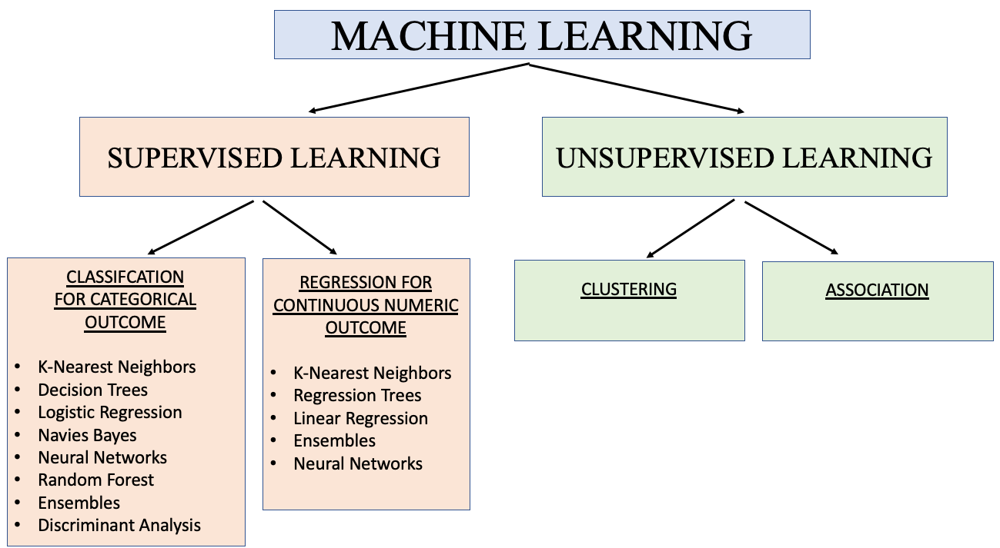
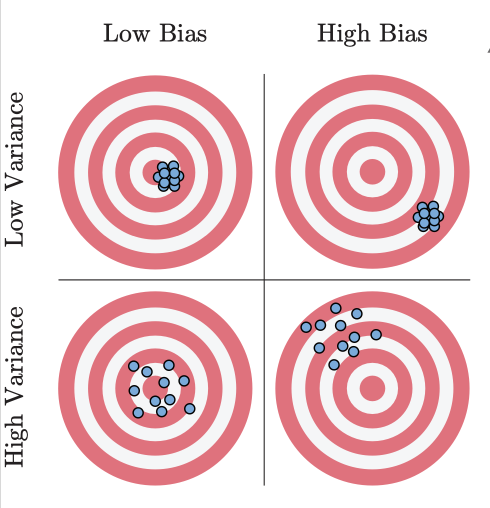

# Supervised Learning
-------------------------
## Machine Learning Tree


-------------------------
## UnderFit & OverFit


-------------------------
## Bias & Variance


-------------------------
##  Preprocessing
#### Label Encoding
```python
from sklearn.preprocessing import LabelEncoder
```
#### One Hot Encoding
```python
import pandas as pd
pd.get_dummies(df['column'])
```
#### Standard Scaler
```python
from sklearn.preprocessing import StandardScaler
```
#### Min-Max Scaler
```python
from sklearn.preprocessing import MinMaxScaler
```
-------------------------
## SAMPLING

#### Hold out
```python
from sklearn.model_selection import train_test_split
```

#### Leave One Out
```python
from sklearn.model_selection import LeaveOneOut
```

#### K-Fold
```python
from sklearn.model_selection import KFold
```

#### Stratified K-Fold
```python
from sklearn.model_selection import StratifiedKFold
```
-------------------------
## MODELING
### REGRESSION

#### Linear Regression
```python
from sklearn.linear_model import LinearRegression
```
#### Decision Tree
```python
from sklearn.tree import DecisionTreeRegressor
```
#### Support Vector Machines
```python
from sklearn.svm import SVR
```

### CLASSIFICATION
#### Logistic Regression
```python
from sklearn.linear_model import LogisticRegression
```
#### Naïve Bayes
```python
from sklearn.naive_bayes import GaussianNB,BernoulliNB,MultinomialNB
```
#### Decision Tree
```python
from sklearn.tree import DecisionTreeClassifier
```
#### Support Vector Machines
```python
from sklearn.svm import SVC
```

-------------------------
## Performance Metrics
### REGRESSION
#### Mean Absolute Error (MAE)
```python
from sklearn.metrics import mean_absolute_error
```
#### Mean Squared Error (MSE)
```python
from sklearn.metrics import mean_squared_error
```
#### Root Mean Squared Error (RMSE)
```python
from sklearn.metrics import mean_squared_error
import numpy as np
np.sqrt(mean_squared_error(y_test,y_pred))
```
#### R-Squared
```python
from sklearn.metrics import r2_score
```
#### Adjusted R-squared
```python
from sklearn.metrics import r2_score
import numpy as np
r2=r2_score(y_test,y_pred)
n=len(y_test)
#Number of features
k=1
adjusted_r2 = 1 - (1 - r2) * (n - 1) / (n - k - 1)
```

### CLASSIFICATION
>#### Accuracy
```python
from sklearn.metrics import accuracy_score
```
>#### Precision and Recall
```python
from sklearn.metrics import precision_score, recall_score
```
>#### Specificity
```python
from sklearn.metrics import confusion_matrix
tn, fp, fn, tp = confusion_matrix(y_test, y_pred).ravel()
specificity = tn / (tn + fp)
```
>#### F1-score
```python
from sklearn.metrics import f1_score
```
>#### AUC-ROC
```python
from sklearn.metrics import roc_auc_score
```
