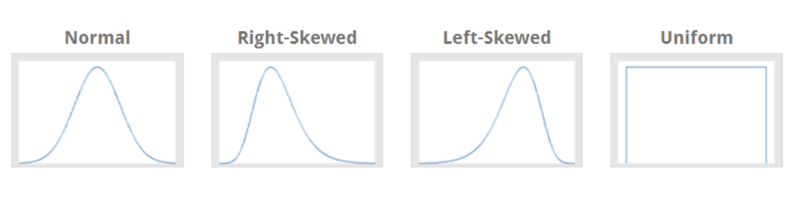

# 1. Measures of Central Tendency

**Measures of Central Tendency** are statistical metrics that describe the center or typical value of a dataset. They summarize data with a single value that represents the middle or center of its distribution.

## Types of Central Tendency

### 1. Mean
The arithmetic average of all data points.

**_Formula:_**
### $\frac{\sum{x_i}}{n}$
_where:_
- $x_i$ is ith observation, 1 ≤ i ≤ n
- _n_ is Number of observations

### 2. Median
The middle value in a sorted dataset. If the number of observations is even, the median is the average of the two middle numbers.

**_Formula:_**

_For Even_
$M=(\frac{n+1}{2})^{th}$

_For Odd_
$M=\frac{(\frac{n}{2})^{th}+(\frac{n}{2}+1)^{th}}{2}$

_where:_
- _n_ is Number of observations

### 3. Mode
The value that appears most frequently in the dataset.

## Summary

- **Mean:** Best for data without extreme outliers, sensitive to outliers.
- **Median:** Best for skewed data or data with outliers.
- **Mode:** Best for categorical data or identifying the most frequent value.
__________________________

# 2. Measures of Dispersion

  

**Measures of Dispersion** quantify the spread or variability within a dataset. They provide insights into how much the data points differ from the central tendency measures (like the mean or median).

## 1. Variance

The average of the squared differences between each data point and the mean.
**Formulas:**
- **Population Variance (σ²):**
$$\sigma^2=\frac{\sum(X_i - \mu)^2}{N}$$

- **Sample Variance (s²):**
$$s^2=\frac{\sum(X_i - \bar{X})^2}{n-1}$$ 

_where:_
- $X_i$ = each data point
- $\mu$ = population mean
- $\bar{X}$ = sample mean
- $N$ = size of the population
- $n$ = size of the sample

## 2. Standard Deviation

The square root of the variance, representing the average distance of each data point from the mean.
**Formulas:**
- **Population Standard Deviation (σ):**
#### $\sigma=\sqrt{\sigma^2}$

- **Sample Standard Deviation (s):**
#### $s=\sqrt{s^2}$
_________________________
# 3. Measures of Shape
## 1. Skewness 
Skewness can be defined as a statistical measure that
describes the lack of symmetry or asymmetry in the probability distribution
of a dataset. It quantifies the degree to which the data deviates from a
perfectly symmetrical distribution, such as a normal (bell-shaped)
distribution. Skewness is a valuable statistical term because it provides
insight into the shape and nature of a dataset’s distribution.

## 2. Histograms 

A **histogram** is a graphical representation of the distribution of a dataset. It displays data using bars of different heights, where each bar groups numbers into ranges (bins).

## Key Features

- **Bins**: The intervals that represent the range of data values.
- **Height of Bars**: Indicates the frequency (count) of data points within each bin.
- **Continuous Data**: Histograms are used primarily for continuous data.

## Interpretation
- **Shape**: The overall shape (e.g., symmetrical, skewed) provides insight into the distribution.
- **Central Tendency**: The location of the peak(s) gives an idea of where most data points are concentrated.
- **Spread**: The width of the histogram shows the variability in the data.

## 3. Box plot
