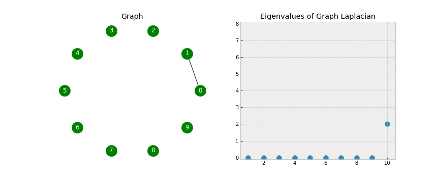
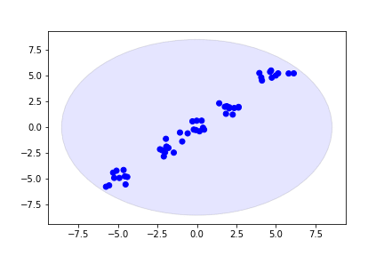
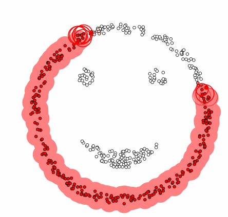

### K-Means Clustering

**Mathematical Foundation:**
1. **Objective Function**: The goal of K-Means is to minimize the within-cluster sum of squares (WCSS). This can be expressed mathematically as:
$$J=\sum_{i=1}^{K} \sum_{x \in C_i} ||x - \mu_i||^2$$
   where $$K$$ is the number of clusters, $$C_i$$ is the set of points in cluster $$i$$, and $$\mu_i$$ is the centroid of cluster $$i$$.

3. **Steps**:
   - **Initialization**: Randomly select $$K$$ initial centroids.
   - **Assignment Step**: Assign each data point to the nearest centroid:
     $$C_i = \{x_j : ||x_j - \mu_i||^2 < ||x_j - \mu_k||^2, \forall k \neq i\}$$
   - **Update Step**: Calculate new centroids as the mean of assigned points:
     $$\mu_i = \frac{1}{|C_i|} \sum_{x_j \in C_i} x_j$$
   - Repeat until convergence.

### Spectral Clustering

**Mathematical Foundation:**
1. **Graph Representation**: Represent data points as a graph where vertices are data points and edges represent similarities. The affinity matrix $$A$$ captures these relationships.

2. **Laplacian Matrix**: Compute the Laplacian matrix $$L = D - A$$, where $$D$$ is the degree matrix (a diagonal matrix where each entry represents the sum of weights for edges connected to that vertex).

3. **Eigenvalue Decomposition**: Find the eigenvalues and eigenvectors of $$L$$. The first $$k$$ eigenvectors corresponding to the smallest eigenvalues form a new representation of the data.

4. **Clustering**: Apply K-Means to these eigenvectors to identify clusters.

### Agglomerative Clustering

**Mathematical Foundation:**
1. **Distance Measures**: Define a distance metric (e.g., Euclidean distance) to quantify how similar or dissimilar two clusters are.

2. **Linkage Criteria**: Decide how to measure the distance between clusters:
   - **Single Linkage**: Minimum distance between points in two clusters.
   - **Complete Linkage**: Maximum distance between points in two clusters.
   - **Average Linkage**: Average distance between all pairs of points in two clusters.

3. **Merging Process**:
   - Start with each point as its own cluster.
   - Iteratively merge the two closest clusters based on the chosen linkage criterion until a stopping condition is met (e.g., a specified number of clusters).

### DBSCAN (Density-Based Spatial Clustering of Applications with Noise)

**Mathematical Foundation:**
1. **Core Points, Border Points, and Noise**:
   - A point $$p$$ is a core point if it has at least $$MinPts$$ neighbors within a radius $$\epsilon$$.
   - A border point is within $$\epsilon$$ of a core point but does not have enough neighbors to be a core point.
   - Noise points are neither core nor border points.

2. **Cluster Formation**:
   - Start with an arbitrary point and retrieve its neighbors.
   - If it’s a core point, form a cluster and recursively include all reachable core points.
   - Continue this process until all points have been processed.

3. **Mathematical Representation**:
   - For a point $$p$$:
     - The neighborhood is defined as:
       $$N_\epsilon(p) = \{q : d(p, q) < \epsilon\}$$
     - A point is classified as a core point if:
       $$|N_\epsilon(p)| \geq MinPts$$

---
# [next](unsupercode.ipynb)
